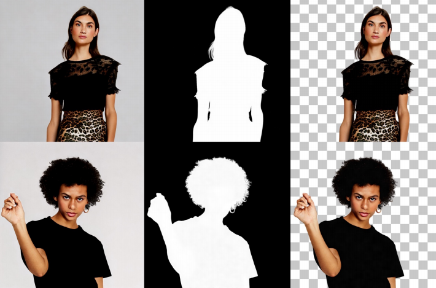

<table align="center">
    <thead>
        <tr>
            <th>Date</th>
            <th>Paper</th>
        </tr>
    </thead>
    <tbody align="center" valign="center">
        <tr>
            <td rowspan="2">2024-03-19</td>
            <td><a href="https://arxiv.org/abs/2403.11077">Zippo: Zipping Color and Transparency Distributions into a Single Diffusion Model</a></td>
        </tr>
        <tr>
            <td></td>
        </tr>
        <tr>
            <td rowspan="2">2024-03-10</td>
            <td><a href="https://arxiv.org/abs/2403.06168">DiffuMatting: Synthesizing Arbitrary Objects with Matting-level Annotation</a></td>
        </tr>
        <tr>
            <td></td>
        </tr>
        <tr>
            <td rowspan="2">2024-02-27</td>
            <td><a href="https://arxiv.org/abs/2402.17113">Transparent Image Layer Diffusion using Latent Transparency</a></td>
        </tr>
        <tr>
            <td></td>
        </tr>
    </tbody>
</table>
